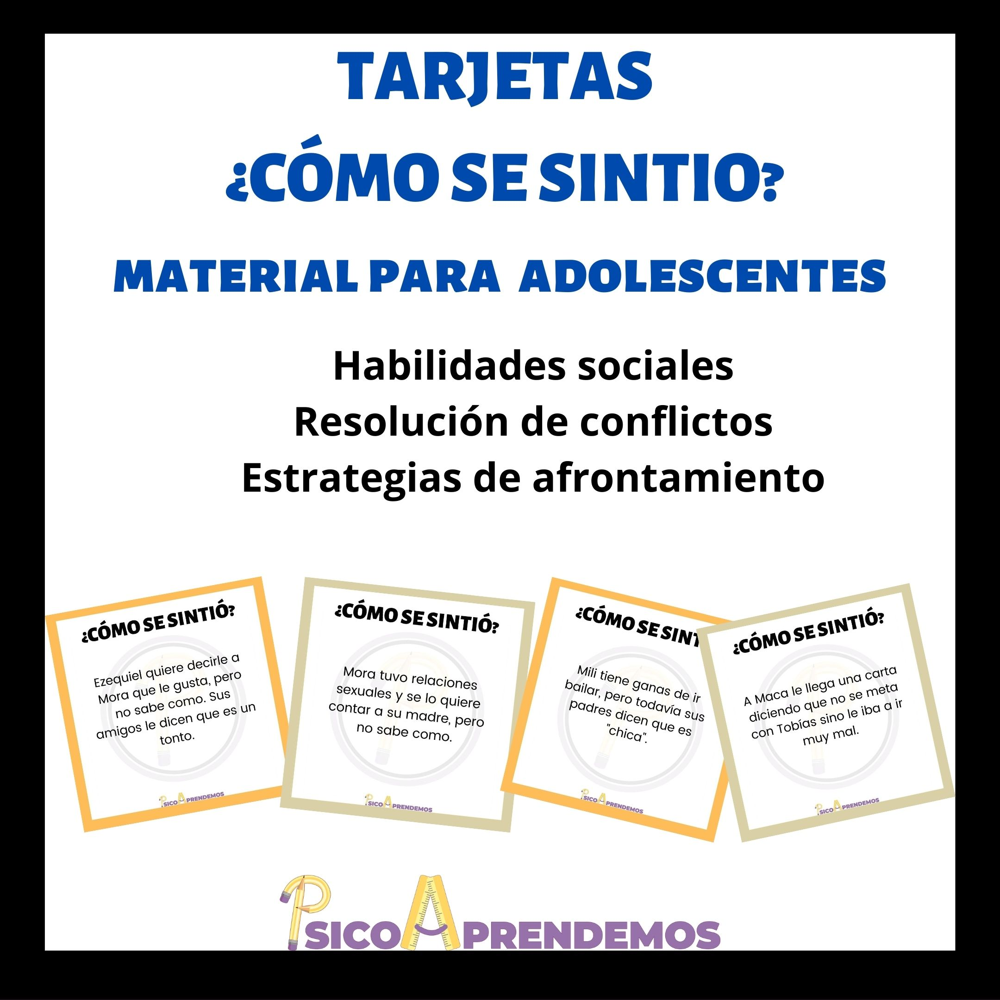

    

<h2>Contacto</h2>

Para realizar la compra escribime a psicologiaprendemos@gmail.com y comentandome el material que quisieras

 
 También me podes encontrar en instagram y facebook como @psicoaprendemos

<h2>Materiales</h2>

    

        
        

            <h3>Tarjetas emociones para niños</h3>
            
 50 tarjetas para trabajar conciencia, psicoeducación y regulación emocional + implicación en situaciones + creatividad. 

            
 Constan de imágenes y ejemplos de diversas emociones donde se pregunta: ¿Qué emoción siente el niño/la niña? ¿Qué crees que le ha pasado? 

            
 Se envian en 3 formatos para que uses el más cómodo y lo imprimas en el tamaño que desees. 

            

                
$250 / USD 8
 
            

        

    

    

        
        

            <h3>Tarjetas ¿Cómo se sintió? para adolescentes</h3>
            
 40 tarjetas para trabajar habilidades sociales, resolución de conflictos y estrategias de afrontamiento.

            
 Excelentes para psicoeducación, para sesiones lúdicas y distendias, para fortalecer el vínculo terapéutico, para talleres en escuelas o hasta conversaciones familiares. 

            
 Son diversos ejemplos de temáticas típicas de la adolescencia donde se pregunta ¿Cómo se sintío ...? 

            
 Se envian en 3 formatos  para que uses el más cómodo y lo imprimas en el tamaño que desees. 

            

              
$290
 
            

        

    

    

        
        

            <h3>Tarjetas emociones para niños</h3>
            
 50 tarjetas para trabajar conciencia, educación y regulación emocional + implicación en situaciones. 

            

                
$250 / USD 8
 
            

        

    

    

        
        

            <h3>Tarjetas emociones adultos</h3>
            
Logra encontrar las emociones escondidas en tus pacientes, sus mas oscuros secretos y la posibilidad o no de que mate a su esposa en las proximas 48 horas

            

              
$1500
 
            

        

    

    

        
        

            <h3>Tarjetas emociones para niños</h3>
            
 50 tarjetas para trabajar conciencia, educación y regulación emocional + implicación en situaciones. 

            

                
$250 / USD 8
 
            

        

    

    

        
        

            <h3>Tarjetas emociones adultos</h3>
            
Logra encontrar las emociones escondidas en tus pacientes, sus mas oscuros secretos y la posibilidad o no de que mate a su esposa en las proximas 48 horas

            

              
$1500
 
            

        

    

    

