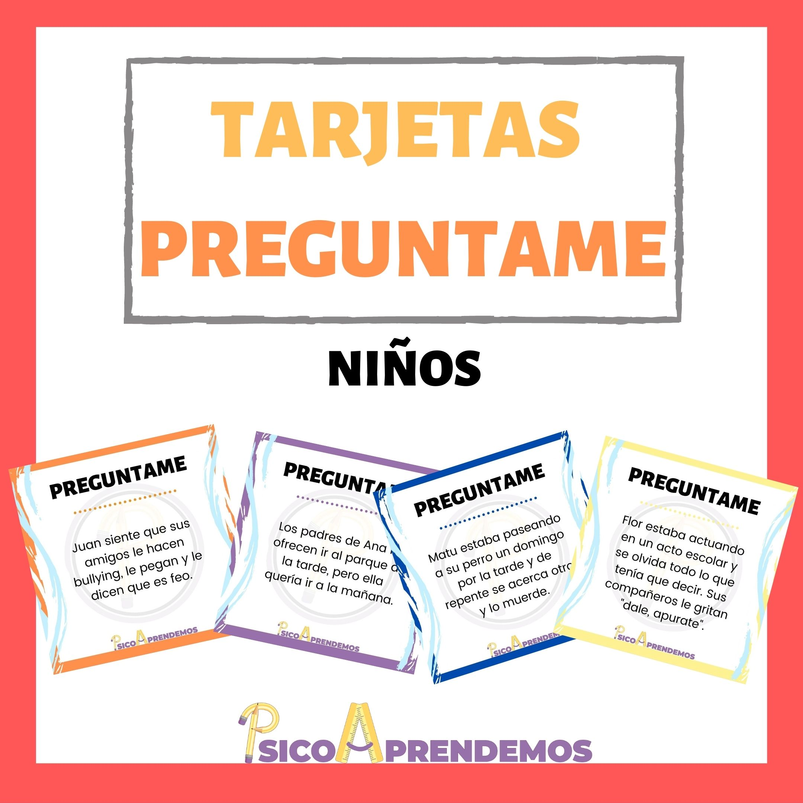
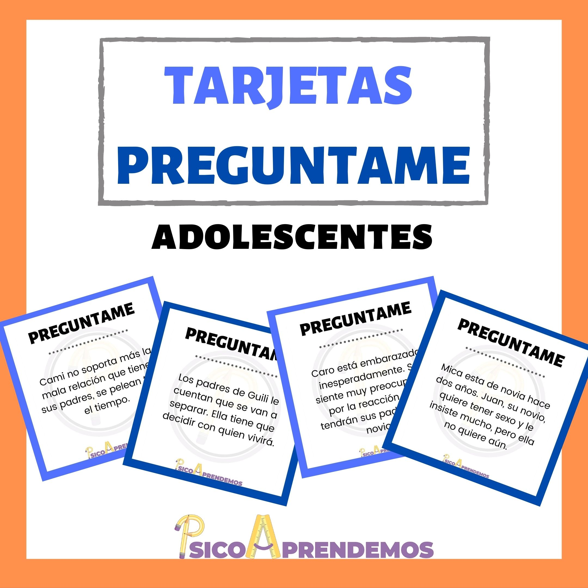
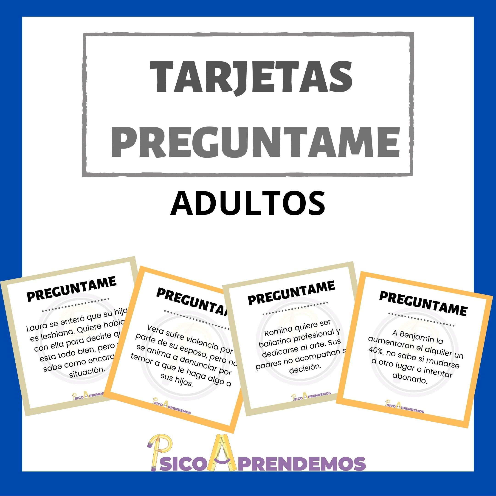

    

<h2>¿Quién soy?</h2>

Mi nombre es Florencia Blanco, soy Lic. en Psicología y estudiante del profesorado de educación primaria. Atiendo el consultorio a niños/adolescentes y trabajo en escuelas.

 
Me encanta el mundo infantil y los juegos, por eso uní mis ganas, conocimiento y un poco de creatividad para crear estos materiales que espero te gusten y les des mucha utilidad. Todos fueron pensados para usar tanto de forma virtual como presencial imprimiéndolos.

    
<h2>Métodos de pago</h2>

Para realizar la compra escribime a <strong>psicologiaprendemos@gmail.com</strong>, comentame el material que quisieras y te envio los datos.

  
Medios de pago: transferencia bancaria o  <a href="https://paypal.me/psicoaprendemos?locale.x=es_XC">PayPal</a>.
  
 
También me podes encontrar en instagram y facebook como <strong>@psicoaprendemos</strong>

<h1>Materiales</h1>
   

    

        
        

            <h3>Tarjetas "Preguntame" - niños</h3>
            
 40 tarjetas con situaciones típicas de la niñez escritas en tercera persona + preguntas modelo a contestar: ¿Cómo se sintió?, ¿Qué hizo?, ¿Qué pensó? y algunas más. 

            
 Sirven trabajar habilidades sociales, resolución de conflictos y estrategias de afrontamiento. Además, son excelentes para psicoeducación, para sesiones lúdicas y distendidas, para fortalecer el vínculo terapéutico, para talleres en escuelas o hasta en conversaciones familiares. 

            
 Se envían en formato pdf, jpeg y word para que utilices el que te sea más cómodo o lo imprimas en el tamaño que desees. 

            

              
$250/ USD 6
 
            

        

    

    

        
        

            <h3>Tarjetas "Preguntame" - adolescentes</h3>
            
 40 tarjetas con situaciones típicas de la adolescencia escritas en tercera persona + preguntas modelo a contestar: ¿Cómo se sintió?, ¿Qué hizo?, ¿Qué pensó? y algunas más.

            
 Sirven trabajar habilidades sociales, resolución de conflictos y estrategias de afrontamiento. Ademas, son excelentes para psicoeducación, para sesiones lúdicas y distendidas, para fortalecer el vínculo terapéutico, para talleres en escuelas o hasta en conversaciones familiares.

            
 Se envían en formato pdf, jpeg y word para que utilices el que te sea más cómodo o lo imprimas en el tamaño que desees. 

            

                
$250 / USD 6
 
            

        

    

    

        
        

            <h3>Tarjetas "Preguntame" - adultos</h3>
            
 40 tarjetas con situaciones típicas de la adultez escritas en tercera persona + preguntas modelo a contestar: ¿Cómo se sintió?, ¿Qué hizo?, ¿Qué pensó? y algunas más. 

            
 Sirven trabajar habilidades sociales, resolución de conflictos y estrategias de afrontamiento. Además, son excelentes para psicoeducación, para sesiones lúdicas y distendidas, para fortalecer el vínculo terapéutico, para talleres grupales o hasta en conversaciones familiares.

            
 Se envían en formato pdf, jpeg y word para que utilices el que te sea más cómodo o lo imprimas en el tamaño que desees. 

            

                
$250 / USD 6
 
            

        

    

    <h3>¡Próximamente ... más materiales!</h3>
        
<strong> Hay promos y descuentos comprando varios materiales.</strong>

    
 "Preguntame" para niños + adolescentes = $450 / USD 11 

    
 "Preguntame" para niños + adolescentes +  adultos = $690 / USD 16 

